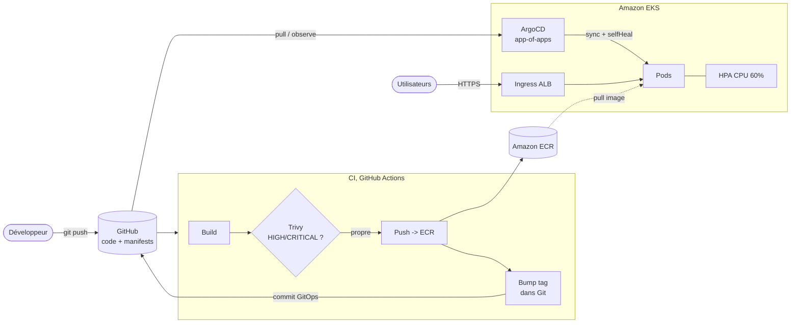

# 🚀 Microservices sur EKS en GitOps

*Plateforme e-commerce de démonstration : 4 microservices conteneurisés,
provisionnés sur Amazon EKS par Terraform, empaquetés avec Helm et déployés en
continu par ArgoCD (pattern app-of-apps), avec autoscaling HPA et sécurité
supply-chain (scan d'images Trivy bloquant).*


> **Contexte**, Ce dépôt fait partie d'un portfolio d'ingénieur DevOps / AWS
> Solutions Architect. Il démontre la maîtrise des conteneurs, de l'orchestration
> Kubernetes (EKS), du modèle GitOps (pull-based) et de la sécurité de la chaîne
> d'approvisionnement logicielle. L'infrastructure est entièrement décrite en
> code (Terraform) et les déploiements sont réconciliés en continu depuis Git.

## 📋 Sommaire

- [🎯 Contexte & objectif](#-contexte--objectif)
- [🏗️ Architecture](#️-architecture)
- [🧱 Stack technique](#-stack-technique)
- [📁 Structure du dépôt](#-structure-du-dépôt)
- [✅ Prérequis](#-prérequis)
- [🚀 Démarrage rapide](#-démarrage-rapide)
- [🔑 Points clés d'implémentation](#-points-clés-dimplémentation)
- [📊 Observabilité](#-observabilité)
- [🔐 Sécurité](#-sécurité)
- [💰 Coûts & teardown](#-coûts--teardown)
- [🧪 Tests & validation](#-tests--validation)
- [🗺️ Roadmap](#️-roadmap)
- [🎓 Ce que ce projet démontre](#-ce-que-ce-projet-démontre)
- [📄 Licence](#-licence)

## 🎯 Contexte & objectif

L'objectif est de bâtir une **plateforme de microservices production-ready** sur
Kubernetes en suivant les bonnes pratiques cloud-native :

- **Conteneurisation** : images multi-stage, non-root, minimales.
- **Orchestration** : Amazon EKS provisionné par Terraform (modules officiels).
- **GitOps** : Git comme unique source de vérité ; ArgoCD réconcilie le cluster
  (modèle **pull**), aucun accès direct de la CI au cluster.
- **Autoscaling** : `HorizontalPodAutoscaler` piloté par l'utilisation CPU.
- **Supply-chain security** : scan Trivy **bloquant** sur HIGH/CRITICAL,
  permissions AWS minimales par pod via **IRSA**, images publiées sur ECR avec
  tags immuables.

Les services modélisent un mini e-commerce :

| Service | Stack | Rôle |
| --- | --- | --- |
| `api-gateway` | Node.js / Express | Point d'entrée HTTP, route vers `orders` et `payments`. |
| `orders` | Python / FastAPI | Création et consultation de commandes. |
| `payments` | Python / FastAPI | Autorisation de paiements (secrets via IRSA). |
| `frontend` | Node.js / Express | Page web de démonstration consommant l'API. |

## 🏗️ Architecture

Le détail (diagrammes, app-of-apps, composants) est dans
[`docs/architecture.md`](docs/architecture.md).



### Flux GitOps (pull vs push)

- **CI = écrit dans Git.** GitHub Actions construit, teste, scanne et pousse les
  images sur ECR, puis **met à jour le tag d'image** dans les manifestes ArgoCD
  et committe ce changement.
- **CD = ArgoCD lit Git.** ArgoCD, exécuté **dans le cluster**, tire l'état
  désiré depuis Git et réconcilie le cluster (`automated` + `prune` + `selfHeal`).
- La CI **n'a aucun credential cluster** : modèle pull, surface d'attaque réduite,
  auditabilité totale via l'historique Git, rollback par `git revert`.

## 🧱 Stack technique

| Composant | Rôle | Pourquoi |
| --- | --- | --- |
| **Terraform** | Provisionnement IaC du VPC, d'EKS, de l'IRSA et d'ECR | Infra reproductible, versionnée, basée sur les modules officiels `terraform-aws-modules`. |
| **Amazon EKS** | Plan de contrôle Kubernetes managé | Délègue la gestion du control plane à AWS ; intégration native IAM/VPC/ALB. |
| **Managed Node Group** | Nœuds de calcul EC2 auto-gérés | Cycle de vie des nœuds géré par EKS (patching, rotation), auto-scalable. |
| **Amazon ECR** | Registre d'images conteneur | Scan à la poussée, tags immuables, intégration IAM/IRSA. |
| **Docker (multi-stage)** | Construction d'images applicatives | Images minimales, non-root, surface d'attaque réduite. |
| **Helm** | Empaquetage des manifestes Kubernetes | Chart générique paramétré → DRY ; support natif dans ArgoCD (voir ADR 0002). |
| **ArgoCD** | Moteur GitOps (CD pull-based) | Réconciliation continue, anti-dérive, app-of-apps (voir ADR 0001). |
| **HPA (autoscaling/v2)** | Autoscaling horizontal des pods | Adapte le nombre de répliques à la charge CPU. |
| **AWS Load Balancer Controller** | Matérialise les `Ingress` en ALB | Expose le frontend et l'api-gateway via un ALB managé. |
| **IRSA** | Rôles IAM par ServiceAccount | Moindre privilège : chaque pod n'obtient que les droits AWS nécessaires. |
| **Trivy** | Scan de vulnérabilités d'images | Sécurité supply-chain, pipeline bloquant sur HIGH/CRITICAL. |
| **k6** | Test de charge | Génère du trafic pour démontrer le déclenchement du HPA. |

## 📁 Structure du dépôt

```text
03-eks-microservices-gitops/
├── README.md
├── Makefile                       # tf-apply, kubeconfig, argocd-*, load-test, destroy
├── LICENSE                        # MIT
├── .gitignore
├── docs/
│   ├── architecture.md            # diagrammes Mermaid + flux GitOps
│   └── adr/
│       ├── 0001-gitops-argocd.md  # ADR : GitOps/ArgoCD vs déploiement impératif
│       └── 0002-helm-vs-kustomize.md
├── terraform/                     # VPC + EKS + IRSA + ECR + addons
│   ├── providers.tf
│   ├── backend.tf
│   ├── variables.tf
│   ├── main.tf
│   └── outputs.tf
├── services/
│   ├── api-gateway/               # Node.js/Express (Dockerfile multi-stage non-root)
│   ├── orders/                    # Python/FastAPI
│   ├── payments/                  # Python/FastAPI (IRSA)
│   └── frontend/                  # Node.js/Express
├── charts/
│   ├── service-chart/             # chart générique (Deployment/Service/HPA/Ingress/NetworkPolicy)
│   └── microservices-umbrella/    # chart umbrella agrégeant les 4 services
├── argocd/
│   ├── projects.yaml              # AppProject (garde-fous)
│   ├── app-of-apps.yaml           # Application racine
│   └── applications/              # une Application par service
│       ├── api-gateway.yaml
│       ├── orders.yaml
│       ├── payments.yaml
│       └── frontend.yaml
├── .github/workflows/
│   └── ci.yml                     # build + test + scan Trivy + push ECR + bump GitOps
└── k6/
    └── load-test.js               # test de charge (démontre le HPA)
```

## ✅ Prérequis

| Outil | Version recommandée | Usage |
| --- | --- | --- |
| `terraform` | ≥ 1.6 | Provisionnement de l'infrastructure |
| `aws` (CLI) | ≥ 2.15 | Authentification AWS, kubeconfig |
| `kubectl` | ≥ 1.30 | Interaction avec le cluster |
| `helm` | ≥ 3.14 | Rendu/validation des charts |
| `argocd` (CLI) | ≥ 2.11 | Pilotage d'ArgoCD (optionnel, l'UI suffit) |
| `k6` | ≥ 0.50 | Test de charge |
| `docker` | ≥ 24 | Build local des images |

Un compte AWS avec les droits de créer VPC/EKS/IAM/ECR est requis. Le backend
Terraform (S3 + DynamoDB) doit exister au préalable (voir `terraform/backend.tf`).

## 🚀 Démarrage rapide

```bash
# 1) Provisionner l'infrastructure (VPC + EKS + IRSA + ECR)
make tf-init
make tf-apply

# 2) Configurer kubectl sur le nouveau cluster
make kubeconfig            # = aws eks update-kubeconfig ...

# 3) Installer ArgoCD dans le cluster
make argocd-install
make argocd-password       # récupère le mot de passe admin initial

# 4) Bootstrap GitOps : applique l'AppProject + l'app-of-apps
make argocd-bootstrap
#    -> ArgoCD crée et synchronise automatiquement les 4 microservices

# 5) (optionnel) Ouvrir l'UI ArgoCD
make argocd-ui             # https://localhost:8081
```

> **Avant le bootstrap**, renseignez en une commande les valeurs propres à votre
> compte (remplace les marqueurs `<ACCOUNT_ID>` et `CHANGE_ME`) :
>
> ```bash
> make configure ACCOUNT_ID=123456789012 GH_OWNER=<votre-pseudo-github>
> # équivalent direct :
> ./scripts/configure.sh <ACCOUNT_ID> <GH_OWNER> [aws-region] [prefixe-state]
> ```
>
> Le script met à jour `argocd/applications/*.yaml`, `argocd/projects.yaml`,
> `argocd/app-of-apps.yaml`, les values Helm et `terraform/backend.tf`, puis
> vérifie qu'aucun marqueur ne subsiste (voir aussi les outputs Terraform
> `ecr_repository_urls` et `payments_role_arn`).

Une fois la première synchro terminée, l'`Ingress` provisionne un ALB :
récupérez son nom DNS et pointez vos enregistrements `shop.example.com` /
`api.shop.example.com` dessus (Route 53 ou autre).

## 🔑 Points clés d'implémentation

- **GitOps pull-based**, ArgoCD s'exécute dans le cluster et tire l'état désiré
  depuis Git. La CI n'écrit que dans Git ; elle ne déploie jamais directement.
  Sync policy `automated` + `prune` + `selfHeal`.
- **Pattern app-of-apps**, une `Application` racine
  ([`argocd/app-of-apps.yaml`](argocd/app-of-apps.yaml)) synchronise le dossier
  `argocd/applications/`, qui contient une `Application` par service. Ajouter un
  service = ajouter un YAML et committer.
- **Chart Helm générique**, un unique [`charts/service-chart`](charts/service-chart)
  paramétré par `values` couvre les 4 services (DRY). Voir
  [ADR 0002](docs/adr/0002-helm-vs-kustomize.md).
- **IRSA**, provider OIDC activé sur EKS ; le service `payments` assume un rôle
  IAM lui donnant un accès **restreint** à ses secrets (`secretsmanager` sur un
  préfixe ARN dédié). Le ServiceAccount est annoté avec l'ARN du rôle.
- **HPA**, chaque déploiement définit des `requests`/`limits` CPU, condition
  nécessaire au HPA. Cible d'utilisation CPU à 60–65 %, avec `behavior` de
  scale-up/down pour lisser les oscillations.
- **Scan d'images**, Trivy s'exécute en CI avant tout push et **échoue le
  pipeline** sur toute vulnérabilité HIGH/CRITICAL corrigeable.

## 📊 Observabilité

- **Métriques EKS**, le `metrics-server` alimente le HPA (`kubectl top pods`,
  `kubectl get hpa -A`). Chaque service expose `/metrics` (format Prometheus :
  durée des requêtes, compteurs métier) ; les pods portent les annotations
  `prometheus.io/scrape` pour un scrape par un Prometheus/AMP éventuel.
- **ArgoCD UI**, visualise l'état de synchro (`Synced`/`OutOfSync`) et de santé
  (`Healthy`/`Degraded`) de chaque Application, l'arbre des ressources et les
  diffs Git vs cluster. Accès via `make argocd-ui`.
- **Logs**, `kubectl logs` par pod ; en production, agrégation via Fluent Bit
  vers CloudWatch Logs ou OpenSearch (voir Roadmap).
- **Sondes**, chaque service expose `/health` (liveness) et `/ready`
  (readiness), exploitées par les probes Kubernetes pour le routage et les
  rolling updates.

## 🔐 Sécurité

- **IRSA & moindre privilège**, pas de credentials AWS statiques dans les pods.
  Chaque ServiceAccount mappe un rôle IAM au périmètre minimal (ex. `payments`
  ne peut lire que `…:secret:shop-platform/dev/payments/*`).
- **Scan Trivy bloquant**, le pipeline CI échoue sur toute vulnérabilité
  HIGH/CRITICAL (`exit-code: 1`), empêchant la publication d'images vulnérables.
- **Images non-root**, Dockerfiles multi-stage ; exécution sous un utilisateur
  dédié non privilégié, `readOnlyRootFilesystem`, `allowPrivilegeEscalation:
  false`, `capabilities: drop ALL`, `seccompProfile: RuntimeDefault`.
- **ECR durci**, tags **immuables** (traçabilité GitOps), scan à la poussée,
  chiffrement au repos, politique de cycle de vie des images.
- **Network policies**, segmentation réseau par service : seuls les flux
  explicitement autorisés passent (ex. seul `api-gateway` peut joindre `orders`
  et `payments`) ; le DNS reste permis.
- **OIDC pour la CI**, GitHub Actions assume un rôle IAM via OIDC (aucune clé
  d'accès longue durée stockée dans le dépôt).
- **EKS**, endpoint API restreignable par CIDR, nœuds en subnets privés, mode
  d'authentification API (RBAC géré côté EKS Access Entries).

## 💰 Coûts & teardown

Estimation indicative en région `eu-west-3` (Paris), hors trafic et stockage,
pour la configuration de démonstration par défaut :

| Poste | Détail | Coût estimé / mois |
| --- | --- | --- |
| EKS control plane | 0,10 $/h × ~730 h | ~73 $ |
| Nœuds EC2 | 3 × `t3.large` à la demande | ~190 $ |
| NAT Gateway | 1 NAT (hors prod) + traitement | ~35 $ |
| Application Load Balancer | 1 ALB partagé (group.name) | ~18 $ |
| ECR / divers | stockage images, requêtes | ~3 $ |
| **Total estimé** | | **~320 $/mois** |

> ⚠️ **Avertissement**, Un cluster EKS coûte cher **même inactif** (le control
> plane est facturé à l'heure, en continu). N'oubliez pas de **tout détruire**
> après la démonstration. Les NAT Gateways et l'ALB facturent également à
> l'heure. Les estimations ci-dessus sont approximatives et varient selon la
> région et l'usage réel.

```bash
# Supprime d'abord les applications (pour libérer les ALB créés par les Ingress),
# puis détruit toute l'infrastructure :
kubectl delete -f argocd/app-of-apps.yaml   # laisse ArgoCD pruner les ressources
make destroy                                # terraform destroy (VPC, EKS, NAT, ECR)
```

## 🧪 Tests & validation

- **Validation des charts (hors cluster)** :

  ```bash
  helm lint charts/service-chart
  helm template api-gateway charts/service-chart \
    -f argocd/applications/api-gateway.yaml   # rendu de contrôle
  ```

- **Test de charge & démonstration du HPA** :

  ```bash
  # Terminal 1, observer l'autoscaling
  make watch-hpa            # kubectl get hpa -A -w

  # Terminal 2, générer la charge
  make load-test BASE_URL=https://api.shop.example.com
  ```

  Le script [`k6/load-test.js`](k6/load-test.js) monte en charge par paliers ;
  l'utilisation CPU des pods dépasse la cible (60 %), le HPA augmente le nombre
  de répliques, puis le réduit après la décrue.

- **Rollback ArgoCD** : en cas de régression, soit `git revert` du commit fautif
  (ArgoCD resynchronise automatiquement), soit, depuis l'UI/CLI ArgoCD :

  ```bash
  argocd app history api-gateway
  argocd app rollback api-gateway <REVISION>
  ```

## 🗺️ Roadmap

- [ ] **Progressive delivery** : déploiements canary/blue-green via Argo Rollouts.
- [ ] **Secrets GitOps** : External Secrets Operator ou Sealed Secrets.
- [ ] **Observabilité complète** : Prometheus (AMP) + Grafana + alerting,
      tracing distribué (OpenTelemetry).
- [ ] **Logs centralisés** : Fluent Bit → CloudWatch Logs / OpenSearch.
- [ ] **Policy as code** : Kyverno ou OPA/Gatekeeper (interdire `:latest`,
      imposer non-root, limites de ressources).
- [ ] **Signature d'images** : Cosign + vérification d'admission (supply-chain).
- [ ] **Cluster Autoscaler / Karpenter** pour l'élasticité des nœuds.
- [ ] **mTLS interne** : mesh de service (Istio / Linkerd / Cilium).

## 🎓 Ce que ce projet démontre

Mapping avec les compétences **AWS Solutions Architect Associate (SAA)** et
**DevOps** :

| Domaine | Démonstration concrète dans ce dépôt |
| --- | --- |
| **Conteneurs & orchestration** | EKS, managed node group, Helm, HPA, probes, rolling updates. |
| **IaC** | VPC + EKS + IRSA + ECR via Terraform (modules officiels), backend distant. |
| **GitOps / CD** | ArgoCD pull-based, app-of-apps, `selfHeal`, rollback par Git. |
| **CI / supply-chain** | GitHub Actions matriciel, scan Trivy bloquant, push ECR via OIDC. |
| **Réseau (SAA)** | VPC multi-AZ, subnets publics/privés, NAT, ALB via Ingress. |
| **Sécurité & IAM (SAA)** | IRSA et moindre privilège, OIDC, images non-root, network policies, ECR durci. |
| **Haute disponibilité (SAA)** | 3 AZ, topology spread, autoscaling pods, node group multi-AZ. |
| **Optimisation des coûts (SAA)** | NAT unique hors prod, ALB partagé, lifecycle ECR, teardown documenté. |
| **Observabilité** | Endpoints `/metrics` Prometheus, `/health` et `/ready`, UI ArgoCD. |

## 📄 Licence

Distribué sous licence **MIT**. Voir [`LICENSE`](LICENSE).
