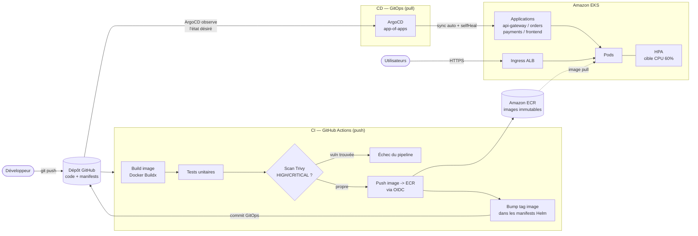
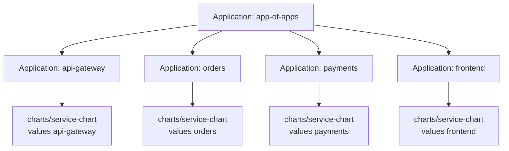

# Architecture

Ce document décrit l'architecture de bout en bout : de la modification du code
jusqu'au déploiement sur le cluster EKS, en passant par la chaîne CI et la
synchronisation GitOps assurée par ArgoCD.

## Vue d'ensemble du flux

## Le flux GitOps : pull vs push

La distinction centrale de ce projet est la séparation stricte entre **CI** et
**CD** :

| Étape | Responsable | Action |
| --- | --- | --- |
| Intégration (CI) | GitHub Actions | build, test, scan, push d'image, **écriture dans Git** |
| Déploiement (CD) | ArgoCD | **lecture de Git** et réconciliation du cluster |

### Modèle « push » (déploiement impératif — ce qu'on N'utilise PAS)

Dans un modèle push classique, le pipeline CI dispose d'identifiants vers le
cluster et exécute `kubectl apply` / `helm upgrade` directement. Inconvénients :

- le cluster fait **confiance à la CI** (credentials Kubernetes stockés dans le CI) ;
- l'état réel du cluster peut **diverger** de Git sans que personne ne le sache ;
- pas de réconciliation continue : une modification manuelle (`kubectl edit`)
  persiste jusqu'au prochain déploiement.

### Modèle « pull » (GitOps — ce qu'on utilise ici)

ArgoCD s'exécute **dans le cluster** et **tire** (pull) en continu l'état désiré
depuis Git. Le dépôt Git est l'unique source de vérité.

1. La CI construit et pousse l'image, puis **modifie le tag d'image** dans les
   manifestes (`argocd/applications/*.yaml`) et committe ce changement.
2. ArgoCD détecte le nouveau commit (polling ou webhook), compare l'état désiré
   (Git) à l'état réel (cluster) et **synchronise** automatiquement.
3. `selfHeal: true` : toute dérive manuelle est automatiquement corrigée vers
   l'état décrit dans Git.
4. `prune: true` : les ressources retirées de Git sont supprimées du cluster.

Avantages : aucun credential cluster dans la CI, auditabilité totale via
l'historique Git, rollback = `git revert`, et cohérence garantie en continu.

## Pattern app-of-apps

Plutôt que d'enregistrer manuellement chaque microservice dans ArgoCD, une
**Application racine** (`argocd/app-of-apps.yaml`) pointe vers le répertoire
`argocd/applications/`. Ce répertoire contient une `Application` ArgoCD par
service. ArgoCD synchronise d'abord la racine, qui crée et gère ensuite les
applications enfants. Ajouter un nouveau service = ajouter un fichier YAML dans
ce répertoire et committer ; tout le reste est automatique.

## Composants AWS et Kubernetes

- **VPC** multi-AZ (3 zones), subnets privés pour les nœuds/pods, subnets
  publics pour les NAT Gateways et les ALB.
- **EKS** : plan de contrôle managé + un managed node group (auto-scalable).
- **IRSA** (IAM Roles for Service Accounts) : chaque pod n'obtient que les
  permissions AWS strictement nécessaires (ex. `payments` lit ses secrets).
- **ECR** : un dépôt par service, scan à la poussée, tags immuables.
- **ArgoCD** : moteur GitOps, déployé dans le namespace `argocd`.
- **AWS Load Balancer Controller** : matérialise les `Ingress` en ALB.
- **HPA** : autoscaling horizontal des pods sur l'utilisation CPU.
